# Cook's Assistant

Web application that tracks recipes and ingredients, and displays the recipes that can be prepared with the currently available ingredients.

# How to Use
## Landing Page
Users will need to register and log into an account.
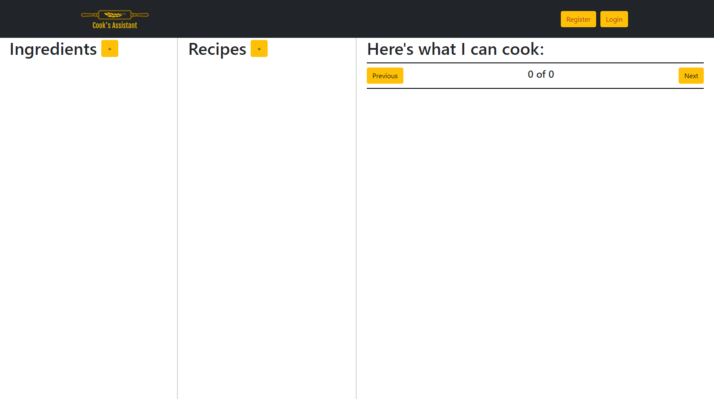
## Register an account
Clicking the register button in the navigation bar will open the registration form. Usernames will have to be unique.
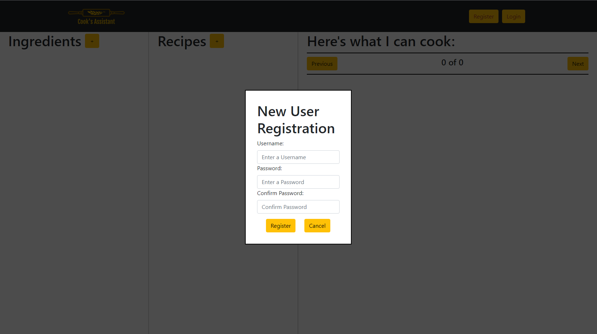
## Login
Clicking the login button in the navigation bar will open the login form, where users will be able to log into an existing account.
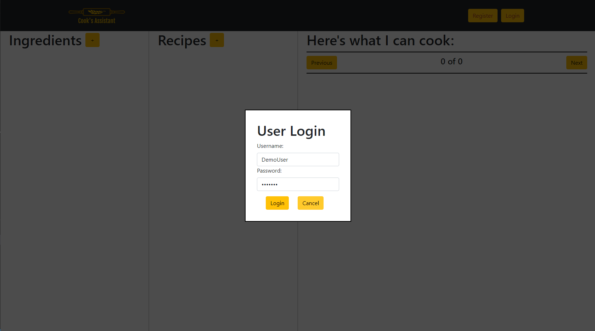
## Add an ingredient
Clicking the + button next to the "Ingredients" header will open a form that will allow logged in users to add and save ingredients to their profile. Users will be required to provide a name for the new ingredient.
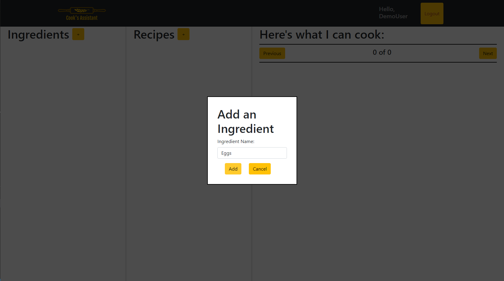
Added ingredients are listed in the ingredients column:
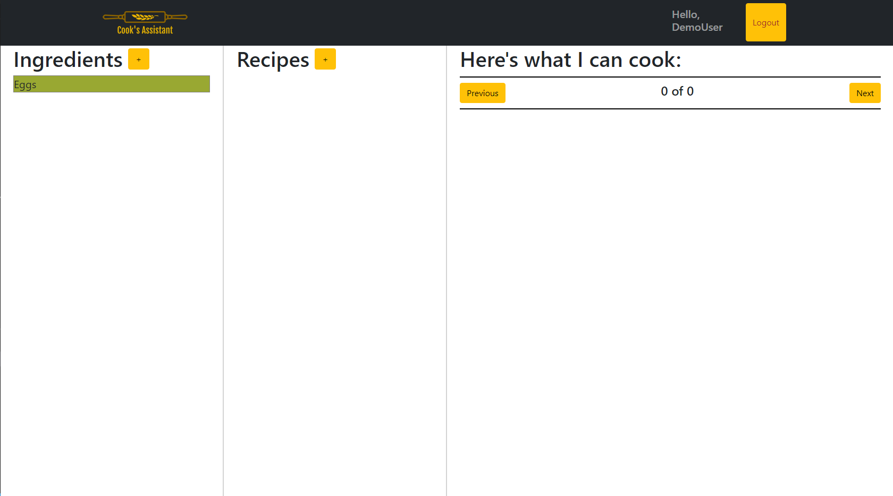
## Deleting or marking an ingredient as unavailable
Clicking on an ingredient inthe ingredients list will open a menu where users will be able to delete an ingredient, or mark an ingredient as being unavailable. Ingredients that are marked as being unavailable will cause recipes that require these ingredients to also be marked as being unavailable.
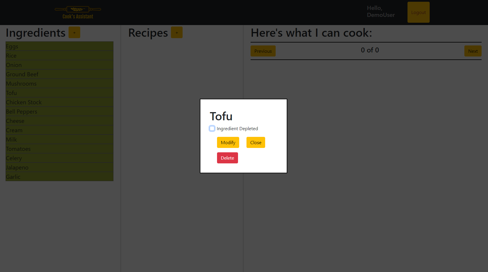
Ingredients that are marked as being unavailable will appear in the ingredients list with a red background. 
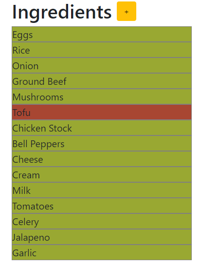
## Add a recipe
Clicking the + button next to the "Recipes" header will open a form that will allow logged in users to add and save recipes to their profile. Users will be required to provide a name for the new recipe, as well as a list of necessary ingredients:
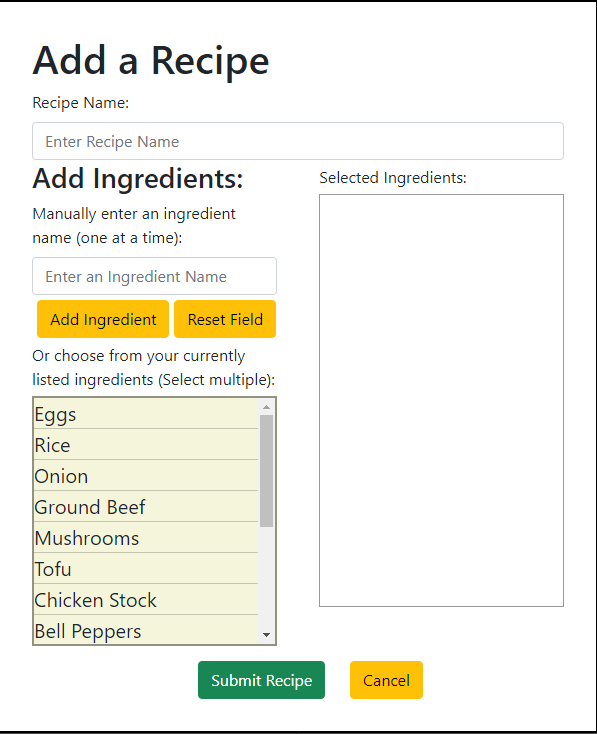
 
Example:
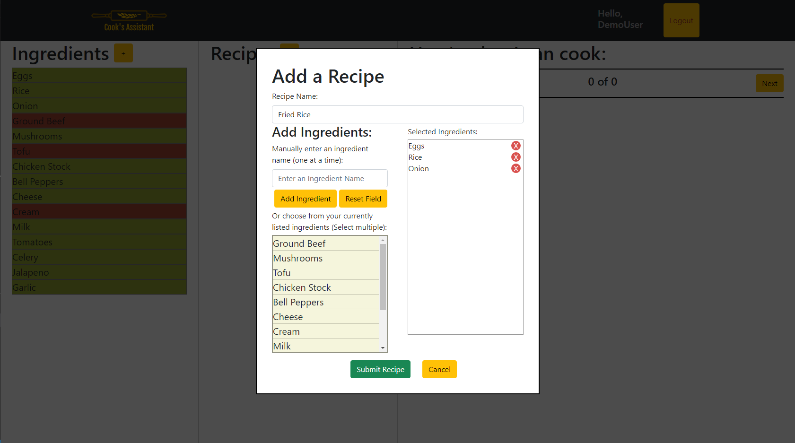
Saved recipes will be listed in the recipes column:
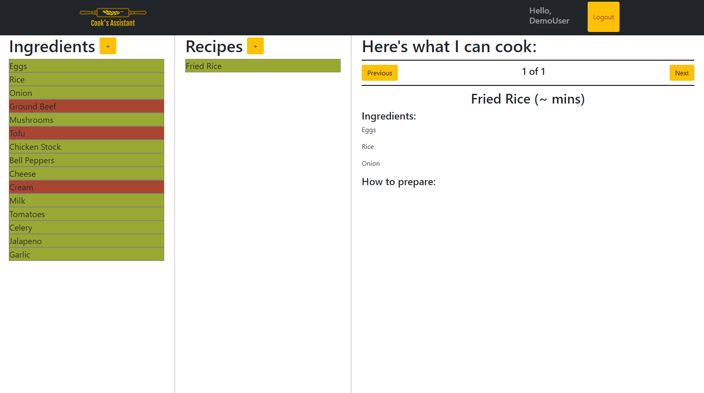
Recipes that cannot be prepared with the currently available ingredients will be highlighted in red.

## View recipes that can be prepared with available ingredients
Recipes that can be prepared with the currently available ingredients can be viewed in the "Here's what I can cook" column. The "Prev" and "Next" buttons will cycle between available recipes.
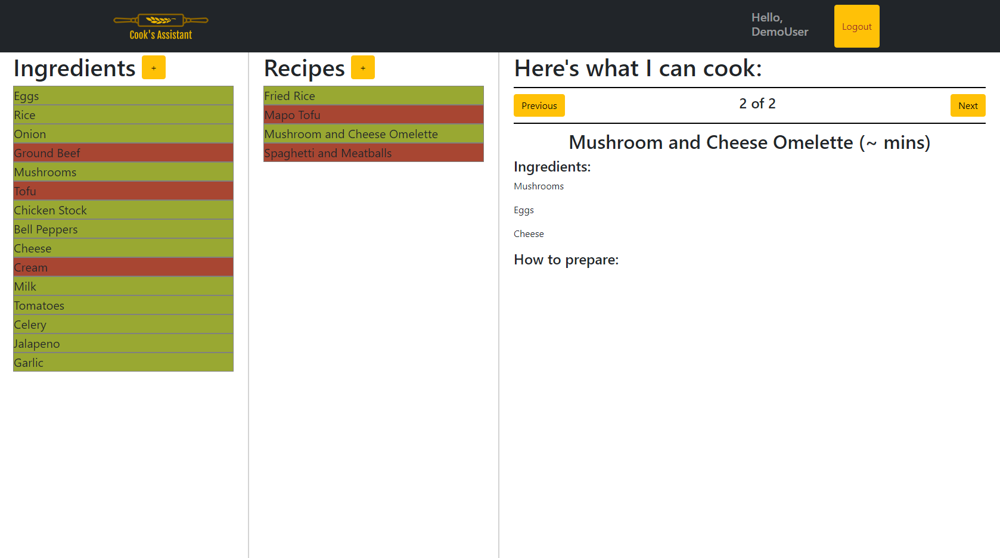

## Built with
- [React-Redux](https://react-redux.js.org/)
- [React Bootstrap](https://react-bootstrap.github.io/)
- [Express](https://expressjs.com/)
- [Node](https://nodejs.org/en/)
- [MongoDB](https://www.mongodb.com/)
